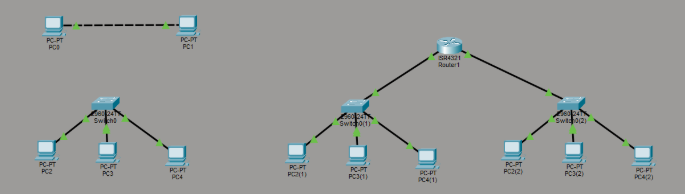
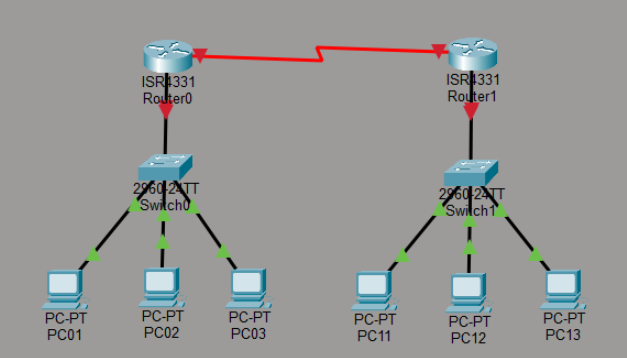
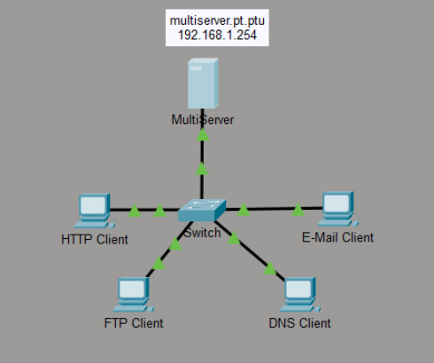
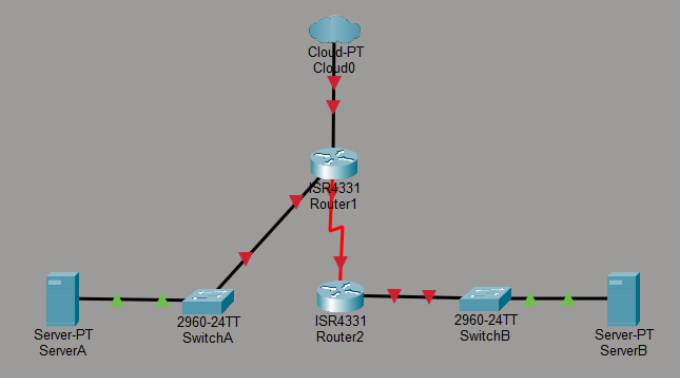

# 📝 Personal Assignments

## Assignment 1 Essay

Assignment link : [personal Essay](https://docs.google.com/document/d/1s7SnRk5C5FWJIBULi0pV9QJDPP1eLx8_Ajq73xU4ZBQ/edit?usp=sharing)

Write an essay about network in daily life.

## Assignment 2 Topology

Assignment link : [Topology](https://docs.google.com/document/d/14l5WtO8LrEsfGFMj_KrcgcRo0kSBL8Tv1P-mHk48FrU/edit?usp=sharing)

This assignment explores different network architectures by categorizing them into three levels: simple peer-to-peer connections between two PCs, switched networks for multiple end devices, and complex infrastructures using routers to interconnect multiple LANs. It provides a visual guide to how network complexity scales from basic local communication to routed connectivity.

## Assignment 3 Not-Simple network

Assignment link : [Not-Simple](https://docs.google.com/document/d/1AbRPcuKH__n6EdF3AXkfzLf8uimcW6u0pIfbVuM12TA/edit?usp=drivesdk)

This assignment involves building a non-simple network in Cisco Packet Tracer by interconnecting two separate LANs through a serial router-to-router connection. The project focuses on configuring IP addresses, default gateways, and static routing commands to ensure successful communication and connectivity between all end devices across different subnets.

## Assignment 4 TCP-UDP

Assignment link : [TCP-UDP](https://docs.google.com/document/d/10Cl9cys9ea3tRAdnYUAWQGmRKKu0C84RDD9asBA64uU/edit?usp=sharing)

This assignment explores the fundamental differences between TCP and UDP protocols through simulated network traffic in Cisco Packet Tracer. By generating and analyzing HTTP, FTP, DNS, and Email traffic, the lab demonstrates key networking concepts such as multiplexing, connection-oriented reliability (TCP), and connectionless best-effort delivery (UDP). Detailed PDU examinations are used to verify how source and destination ports, sequence numbers, and acknowledgement values change during a data conversation.

## Lab 5

Assignment link : [Lab5](https://docs.google.com/document/d/1v2tcchE9dSO8KOoyiubx_anqNG4-aJjzBqlvtkk1RCg/edit?usp=sharing)

This lab focuses on transforming microservices into a realistic enterprise deployment by integrating an Internet Edge Router (R1) with a Branch Router (R2) over a Serial ISP WAN. It demonstrates the deployment of distributed FastAPI microservice stacks across two separate LANs while validating cross-site access and internet reachability via NAT overload. The assignment highlights critical architectural patterns, including public-private boundaries, network segmentation, and hierarchical WAN connectivity.

# 💡 What I have learned from these assignments

## 1. Network Topologies and Core Infrastructure
* **Network Classification**: Learned to identify and differentiate between various network scales, including **Point-to-Point**, **Peer-to-Peer LANs**, and **Routed Networks**.
* **Hardware Functionality**: Gained hands-on experience using **Switches** to connect multiple end devices in a star topology and **Routers** to interconnect different logical subnets.
* **Packet Tracer Mastery**: Developed proficiency in using Cisco Packet Tracer for visual design, CLI configuration, and real-time simulation.

## 2. Protocol Analysis (TCP vs. UDP)
* **Transport Layer Comparison**: Analyzed the fundamental differences between **TCP** (reliable, sequence-based) and **UDP** (connectionless, best-effort).
* **Traffic Multiplexing**: Observed how various protocols—including **HTTP, FTP, DNS, and E-mail**—simultaneously traverse the network through multiplexing.
* **PDU Examination**: Verified data integrity by inspecting Protocol Data Units (PDUs) for source/destination ports, sequence numbers, and acknowledgement flags.

## 3. Advanced Routing and Enterprise Edge
* **Static Routing**: Configured Cisco routers (ISR4331/4321) using the CLI to establish connectivity between disparate LANs via **Serial interfaces**.
* **NAT Overload (PAT)**: Implemented **NAT (Network Address Translation)** on an Internet Edge router to manage boundaries between private LANs and the public internet.
* **WAN Connectivity**: Simulated a realistic **Enterprise Edge** environment using a Serial ISP WAN link (100.10.10.0/30) to bridge a main office with a branch location.

## 4. Distributed Microservices Integration
* **FastAPI Architecture**: Integrated a Week 03 microservice stack (Upload, Processing, and AI services) into a live network topology.
* **Cross-Site Validation**: Successfully validated distributed service communication across a routed WAN and NAT boundary, ensuring data flow from LAN A to LAN B.
* **Enterprise Edge Pattern**: Transitioned from classroom-style labs to a functional **cloud-edge + branch distributed architecture**.

---
**Technical Keywords**:
`Cisco Packet Tracer` `CLI` `NAT Overload` `Static Routing` `TCP/UDP` `FastAPI` `Microservices` `Enterprise Edge` `Serial WAN`

