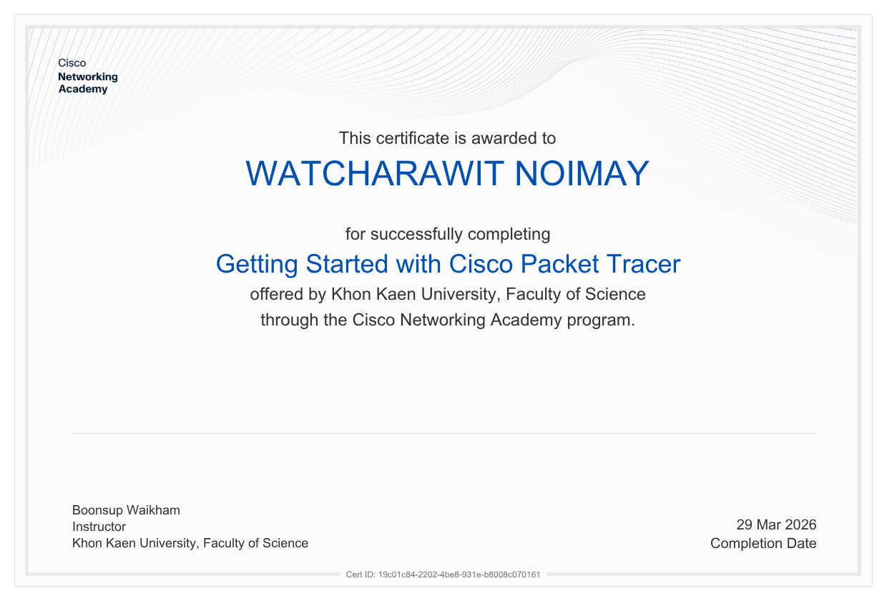
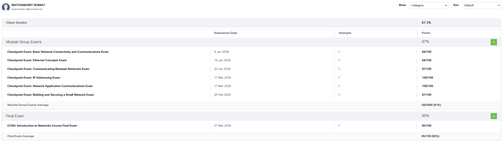

# CP352005-Networks-Portfolio
## About Me
นายวัชรวิศว์ น้อยเมล์ 673380059-1 section 1\
Email : watcharawit.n@kkumail.com\
Computer Science - College of Computing Khon Kaen University

---

## About This Repository
This repository serves as a comprehensive archive for my work in CP352005: Computer Networks and Network Programming. It contains all collection of my academic journey, including:
* Personal Assignments

* Group Assignments & Projects

* Certificates

---

## Personal Assignments

[Click here](Personal_Assignments.md) to view the detail of each assignments

| Assignment | Document Link |
| --- | --- |
| Assignment 1 Essay | [personal Essay](https://docs.google.com/document/d/1s7SnRk5C5FWJIBULi0pV9QJDPP1eLx8_Ajq73xU4ZBQ/edit?usp=sharing) |
| Assignment 2 Topology | [Topology](https://docs.google.com/document/d/14l5WtO8LrEsfGFMj_KrcgcRo0kSBL8Tv1P-mHk48FrU/edit?usp=sharing) |
| Assignment 3 Not-Simple network | [Not-Simple](https://docs.google.com/document/d/1AbRPcuKH__n6EdF3AXkfzLf8uimcW6u0pIfbVuM12TA/edit?usp=drivesdk) |
| Assignment 4 TCP-UDP | [TCP-UDP](https://docs.google.com/document/d/10Cl9cys9ea3tRAdnYUAWQGmRKKu0C84RDD9asBA64uU/edit?usp=sharing) |
| Lab5 | [Lab5](https://docs.google.com/document/d/1v2tcchE9dSO8KOoyiubx_anqNG4-aJjzBqlvtkk1RCg/edit?usp=sharing) |

## Group Assignments

| Assignment | Document Link |
| --- | --- |
| Lab1 | [Lab1](https://drive.google.com/drive/folders/12igTDyQwVWYtyPYPUFp_X_8hRi_3XuIe?usp=sharing) |
| Lab2 | [Lab2](https://drive.google.com/drive/folders/1M2oyONDqAgAM3O3NShCe0fuCJn_DTRtc?usp=sharing) |
| Lab3 | [Lab3](https://docs.google.com/document/d/1VNp8npP7U2oHTbFInu2mMqLKZAhu4DMrg3glnVcItkI/edit?usp=sharing) |
| Lab4 | [Lab4](https://drive.google.com/drive/folders/1-37542pOfWwcTbrW8RJKtGT57pNXccm-?usp=sharing) |
| New Network | [New Network](https://drive.google.com/drive/folders/1efLgvRvZgSj4z_xfi4NvnZRvThgi01-t?usp=sharing) |

## Group Project
Project name : Tastes Through Network\
Project repository : [Tastes Through Network](https://github.com/boatrocl/Network_Project_2026)

Taste Data Transmission Network (TTN) is a Cyber-Physical System simulating end-to-end digital taste transmission to study Data Communication and IoT Networking within the "Internet of Senses" framework. Inspired by the [e-Taste (2025) research](https://www.science.org/doi/10.1126/sciadv.adr4797), it converts taste into digital vectors for real-time delivery via wireless networks and IoT Cloud to a physical actuator.

| Document | Document Link |
| --- | --- |
| Sprint Alpha +1 | [Sprint Alpha](https://drive.google.com/drive/folders/1TGKRI3FodbM9AM4wki3onLOiRvzmlIdf?usp=drive_link) |
| Project Artifacts | [Project Artifacts](https://drive.google.com/drive/folders/1p_LOMelqeetF80HmdlCLc08hhDfGDqzz?usp=sharing) |

## Certificate
Pre1 Computer Networks - Getting Started with Cisco Packet Tracer

## CCNA1: Introduction to Networks Exam Result

